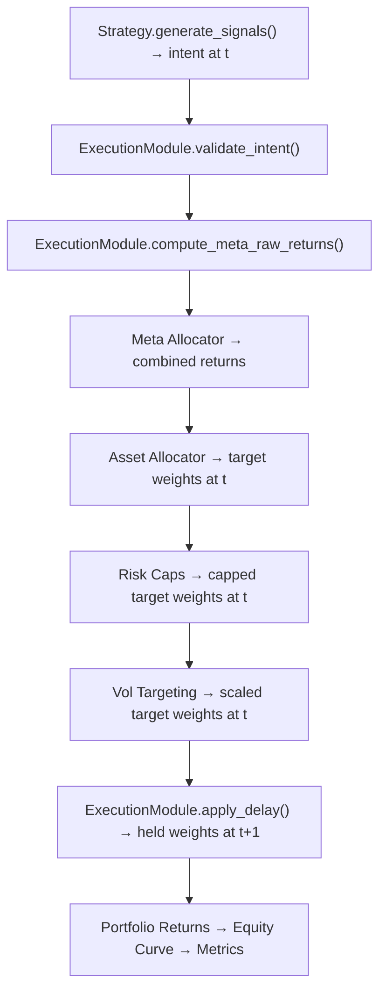

# Execution Model

> **Design Contract**: Every component computes at time *t* using data ≤ *t*.
> The **ExecutionModule** is the single point that applies the execution delay.

## Terminology

| Term | Definition |
|------|-----------|
| **Intent** | Raw strategy output (signals or scores) at decision time *t* |
| **Target weights** | Desired portfolio weights at time *t* (after allocation, risk caps, vol targeting) |
| **Held weights** | Actual portfolio weights applied at *t + execution_delay_days* |
| **Execution delay** | Number of trading days between decision and execution (default: 1) |

## Pipeline Flow



## Key Invariant

> **No component other than `ExecutionModule` may call `.shift()`** for temporal execution lag.

Before this refactoring, `shift(1)` was scattered across 5 locations:
- `TrendStrategy.calculate_returns()` — **removed**
- `MeanRevStrategy.calculate_returns()` — **removed**
- `compute_inverse_vol_weights()` — **removed**
- `apply_vol_targeting()` — **removed**
- `RiskParityAllocator.calculate_weights()` — **removed**

All 5 shifts are now replaced by two calls in the engine:
1. `ExecutionModule.compute_meta_raw_returns()` — shifts intent before multiplying with raw returns
2. `ExecutionModule.apply_delay()` — shifts target weights to produce held weights

## ExecutionPolicy

```python
from sage_core.execution.policy import ExecutionPolicy

policy = ExecutionPolicy(
    signal_time="close",         # When signals are computed
    execution_time="next_open",  # When trades execute
    price_used="open",           # Fill price
    execution_delay_days=1,      # Days between decision and execution
)
```

## ExecutionModule API

| Method | Input | Output | Purpose |
|--------|-------|--------|---------|
| `apply_delay(obj)` | Series/DataFrame | Shifted by `execution_delay_days` | Single canonical shift |
| `compute_meta_raw_returns(intent, raw_ret)` | Per-asset intent + returns | Per-asset realized returns | Signal → return with lag |
| `validate_alignment(index, *objs)` | Reference index + objects | None (raises on error) | Prevent pandas alignment bugs |
| `validate_intent(intent_by_asset)` | Per-asset intent dict | None (raises on error) | Validate signal structure |

## Warmup Formula

```
signal_warmup   = strategy_warmup + meta_allocator_warmup
parallel_warmup = max(signal_warmup, asset_allocator_warmup)
total           = parallel_warmup + execution_delay_days + vol_lookback
```

## Configuration

`ExecutionConfig` is part of `SystemConfig`:

```python
from sage_core.config.system_config import SystemConfig

config = SystemConfig(
    name="My System",
    universe=["SPY", "QQQ"],
    start_date="2020-01-01",
    end_date="2023-12-31",
    execution={"execution_delay_days": 1},
)
```

## Files Changed

| File | Change |
|------|--------|
| `sage_core/execution/__init__.py` | New package |
| `sage_core/execution/policy.py` | `ExecutionPolicy` Pydantic model |
| `sage_core/execution/module.py` | `ExecutionModule` class |
| `sage_core/strategies/base.py` | Removed `calculate_returns()`, added `signal_type` |
| `sage_core/strategies/trend.py` | Removed `calculate_returns()` |
| `sage_core/strategies/meanrev.py` | Removed `calculate_returns()` |
| `sage_core/strategies/passthrough.py` | Removed `calculate_returns()` |
| `sage_core/allocators/inverse_vol_v1.py` | Removed `shift(1)` |
| `sage_core/portfolio/vol_targeting.py` | Removed `shift(1)` |
| `sage_core/meta/risk_parity.py` | Removed `shift(1)` |
| `sage_core/walkforward/engine.py` | Integrated `ExecutionModule` |
| `sage_core/utils/warmup.py` | Uses `execution_delay_days` |
| `sage_core/config/system_config.py` | Added `ExecutionConfig` |
